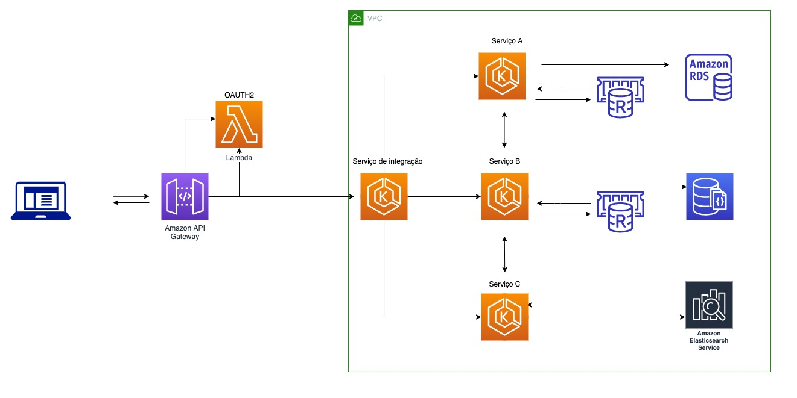

# Simulação de arquitetura em microsserviços.
 
[Microsserviço](https://microservices.io) é uma arquitetura baseada em uma coleção de serviços independentes que são:

* Altamente sustentável e testável
* Baixo acoplamento
* Implantado separadamente
* Organizado de acordo com as regras de negócio.
* Geralmente mantido por uma equipe pequena.

## Exemplo de cenário

Em um determinado sistema de usuários esta sobrecarregado por uma alta demanda 
de solicitações. A segurança das informações tem  níveis diferentes e os consumidores 
de dados podem buscar apenas uma fração ou acesso total. Existe também uma aplicação de 
[Machine Learn](https://pt.wikipedia.org/wiki/Aprendizado_de_m%C3%A1quina) que faz analise desses dados.

## Solução proposta

Após análise do contexto a aplicação foi divida em 3 partes e determinado seus serviços. 

[**Service One**](service_one/README.md) será responsável pela **Base A** que contém informações de extremamente 
sensível e deve ser aplicado proteção e ter um nível de segurança maior

[**Service Two**](service_two/README.md) será responsável pela **Base B** que também contém dados criticos, mas seu acesso 
deve mais rápido que a **Base A** e suas informações também bem são consumidas por um 
sistema de  [Machine Learn](https://pt.wikipedia.org/wiki/Aprendizado_de_m%C3%A1quina).

[**Service Three**](service_three/README.md) será responsável pela **Base C**, essa aplicação armazena eventos que acontecem com o do usuário

Para gerenciamento dos microsserviços e prove uma API centralizada o [**Service Integrator**](service_integrator/README.md) terá o papel
de integração entre os consumidores e os microsserviços

## Esquema

Usando os serviços da [AWS](https://aws.amazon.com/pt/), foi adicionado uma camada de [API Gateway](https://microservices.io/patterns/apigateway.html) com uma função [lambda](https://en.wikipedia.org/wiki/AWS_Lambda) de OATH2 para gerenciar os acessos 
a api do integrador.

O [**Service Integrator**](service_integrator/README.md) tem a responsabilidade de requisitar as informações ao outros microsserviços e 
agregar os resultados em um único payload.

O [**Service One**](service_one/README.md) usará um banco relacional e  criptografar os dados gravados e descriptografa quando obter, irá
armazenar em um [redis](https://redislabs.com/) para evitar carga no banco principal.

[**Service Two**](service_two/README.md)  usará um banco orietado a documento [MongoDB]() por sua natureza de distribuição e no caso 
de uso uma aplicação de [Machine Learn](https://pt.wikipedia.org/wiki/Aprendizado_de_m%C3%A1quina) esta [consumindo seus dados](https://www.mongodb.com/blog/post/training-machine-learning-models-with-mongodb).

O [**Service Three**](service_three/README.md) usará o [Elastic Search](https://www.elastic.co/pt/), é a melhor opção para busca e armazenamento de documentos de eventos.

Obs: ***Por questões de expor com mais facilidade, essa projeto contém dos os serviços citados. Em um caso real, cada um dos microsserviços  teria seu próprio controle de versão.***
